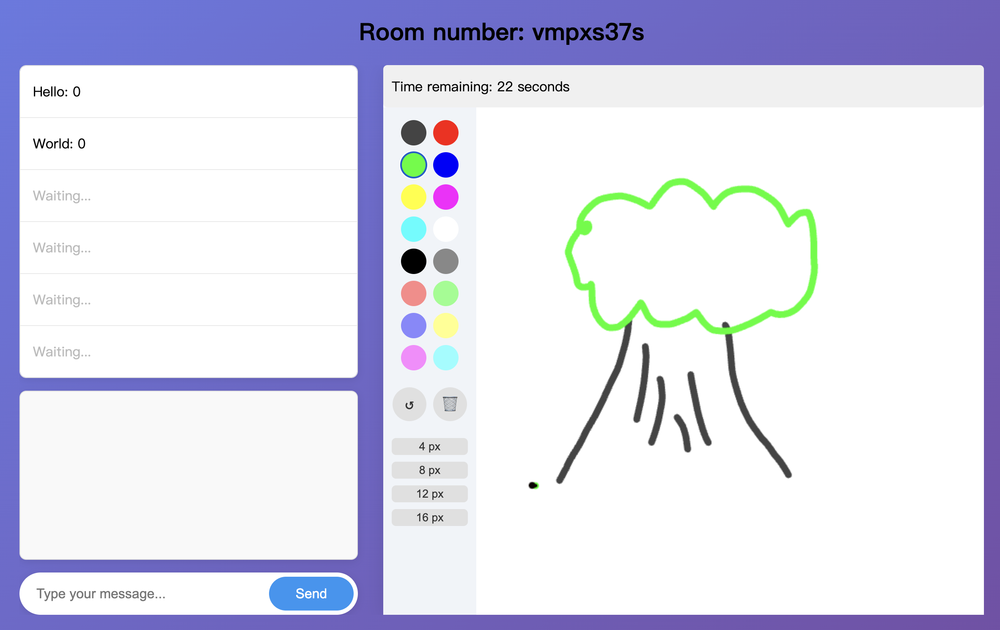

# 簡介

[DrawSomething.js](https://draw-sth-js.onrender.com) 是一款由 React 和 WebSocket 打造的網頁遊戲。玩家輪流擔任畫家和猜題者，通過正確猜出他人的繪畫來得分。得到最高分的玩家將獲得勝利！

# 使用技術

- Next.js
- React.js
- WebSocket
- CSS Modules

# 如何遊玩？

1. 複製此專案
2. cd 至此專案並進行 npm run dev
3. 打開瀏覽器並導航至 http://localhost:3000

# 特別感謝

[React Canvas Draw](https://www.npmjs.com/package/react-canvas-draw) 提供使用者一個可透過畫筆作畫的組件，同時也有許多實用許多實用功能，如調整畫筆粗細、顏色等等。
Draw Something.js 將其作為基礎並加上 WebSocket，使畫布上的內容可以即時渲染至位於不同瀏覽器頁面。
